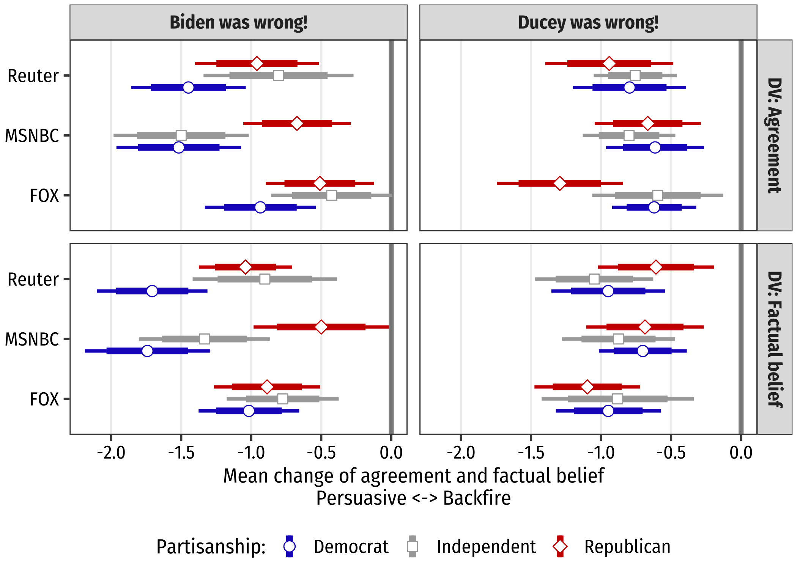
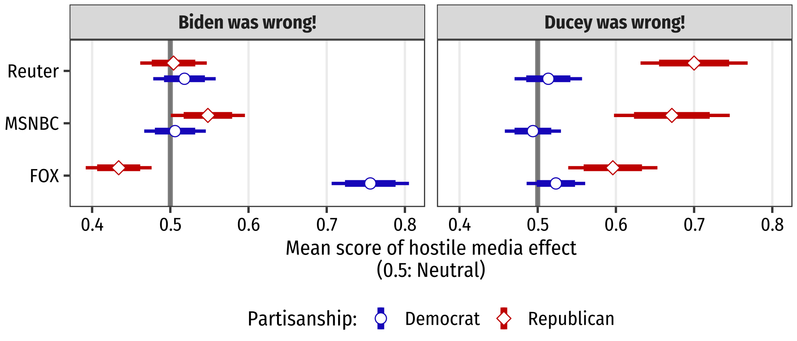

*Forthcoming in Political Psychology*
  

## ABSTRACT

The effectiveness of and its boundary conditions regarding fact-checking news exposure have significant normative and practical implications. While many of the prior studies have focused on the attitudinal consequences of fact-checking news delivered by neutral third parties such as fact-check organizations, relatively less is known as to the effect of fact-checking news delivered by partisan media. Based on the frameworks of motivated reasoning and the hostile media effect, we investigate the possibility of decoupling between attitudinal persuasion and perceptual backfire by fact-checking news by partisan media—that is, exposure to fact-checking news increases bias perception of such news yet nevertheless attitudinally persuades audiences. Based on a series of original experiments conducted in South Korea and in the United States, we find consistent support for our prediction, in that exposure to fact-checking news produces the corrective effects, yet at the same time perceived bias of the fact-checking news systematically varies as a function of the ideological slant of partisan media.
  

## LINKS

- [Preprint](https://osf.io/fws6d/)

- [Pre-analysis plan](https://osf.io/jtbz5)

- [Code](https://github.com/revelunt/Fact-check-experiment)
  

## FIGURES

<b>Figure 1.</b> Persuasive effect of fact-checking news

&nbsp;

<b>Figure 2.</b> Hostile media perception on fact-checking news

&nbsp;

[Go Back to Home](https://jehoonchae.github.io)
