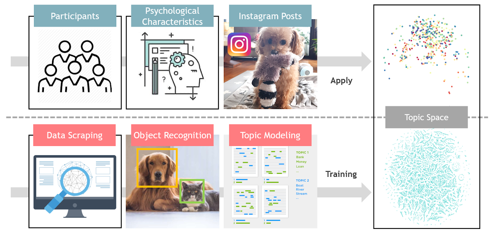
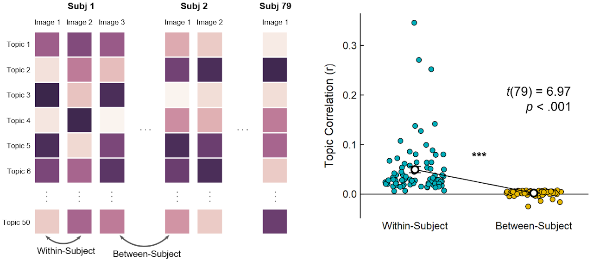
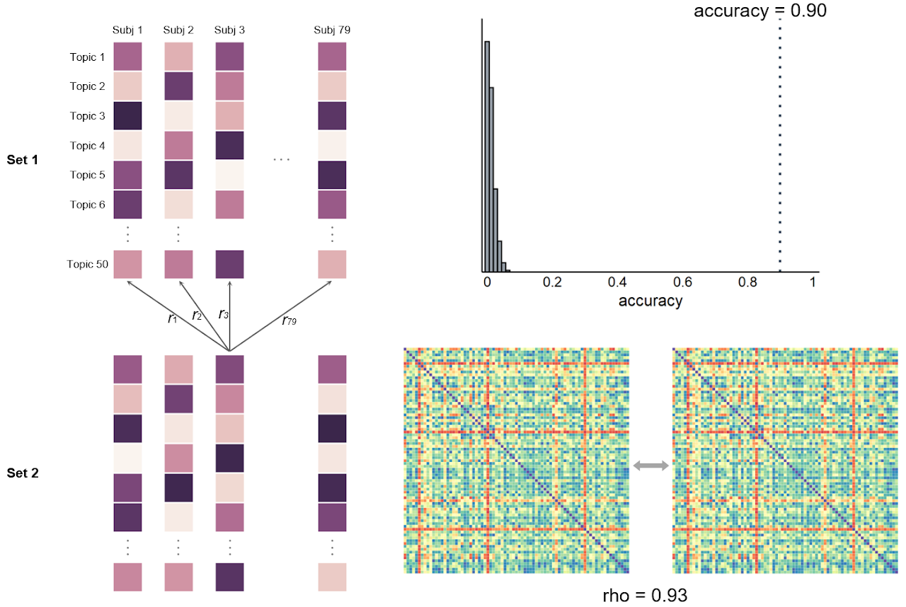
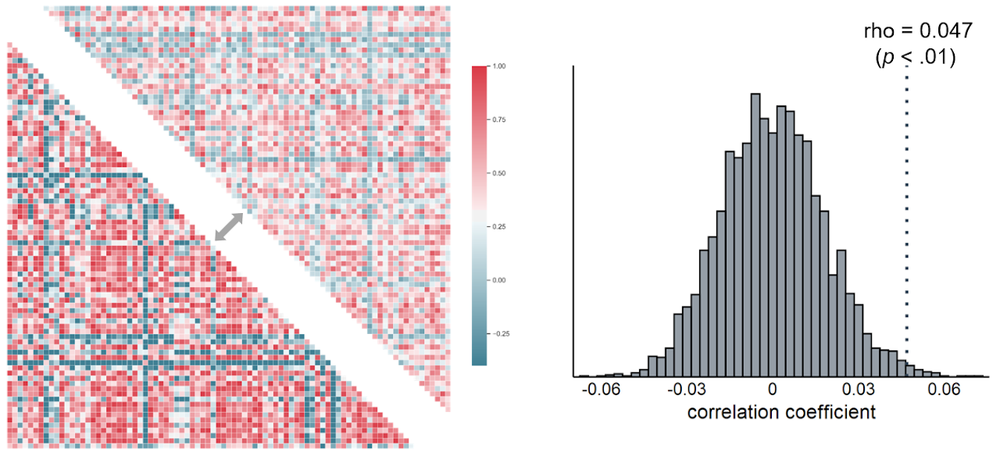

## Abstract

People share their personal experiences and thoughts with other people through social media. Although previous research on social media has been focused mainly on the language use in text-based platforms such as Twitter and Facebook, few studies have been conducted on behavior in image-based platforms such as Instagram. In this study, we tried to quantify various topics in images that people share on Instagram, and to examine whether the characteristics of the images uploaded by each individual are distinguished from each other. In particular, we studied whether these characteristics in images were  related to the individuals’ personality. We collected 48,855 Instagram photos uploaded over two years from a total of 79 participants along with their big 5 personality traits. To systematically quantify common topics that appeared on the Instagram platform, we collected an independent dataset of 78,536 Instagram photos by scraping random images using frequently used hashtags on Instagram, and tagged objects contained in each image using a computer vision object recognition algorithm. We then trained a latent Dirichlet allocation (LDA) topic model that regards each image as a document, and represented all images as a point in a common 50-dimensional topic space. To determine whether the Instagram photos of each participant have unique features  that distinguish them from others, we calculated topic similarity between images. When comparing within-subject topic similarities and between-subject similarities, within-subject similarity was significantly higher than between-subject similarity, suggesting that characteristics of Instagram photos uploaded by each person can be distinguished from other people. Next, to see if participants with similar personalities upload images of similar topics, we conducted inter-subject representational similarity analysis (RSA). When comparing the personality similarity matrix representing similarities between the participants in the big 5 personality traits and the topic similarity matrix representing similarities in the topic space, a significant positive correlation was shown between these two matrices, suggesting that people with similar personalities upload images of similar topics on Instagram.

## Figures

<b>Figure 1.</b> Overview of study designs.

&nbsp;

<b>Figure 2.</b> Results of idiosyncrasy analysis.

&nbsp;

<b>Figure 3.</b> Results of fingerprinting analysis.

&nbsp;

<b>Figure 4.</b> Results of intersubject representational similarity (RSA) analysis.

&nbsp;

[Go Back to Home](https://jehoonchae.github.io)
