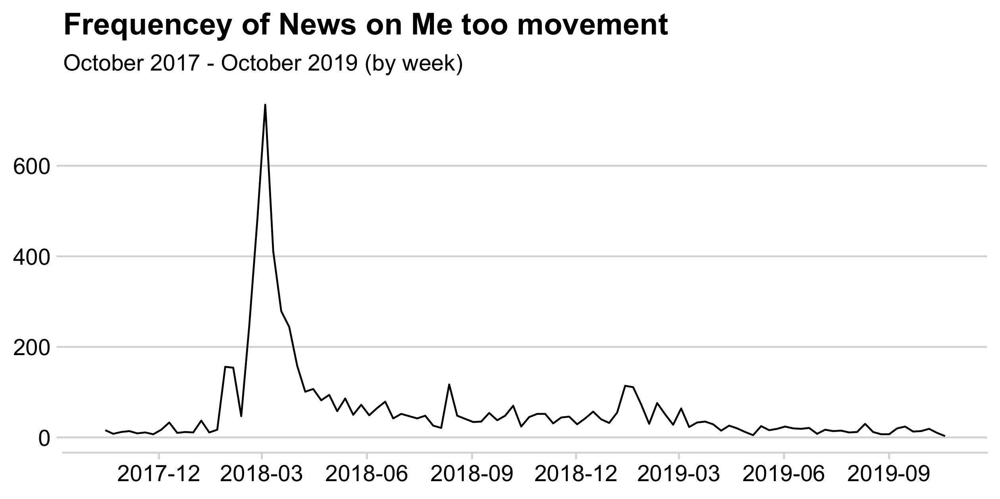
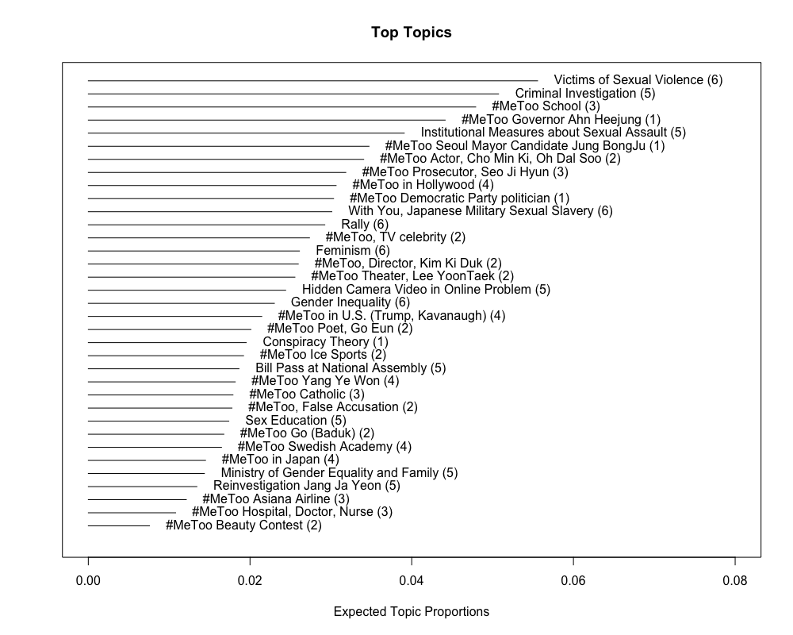
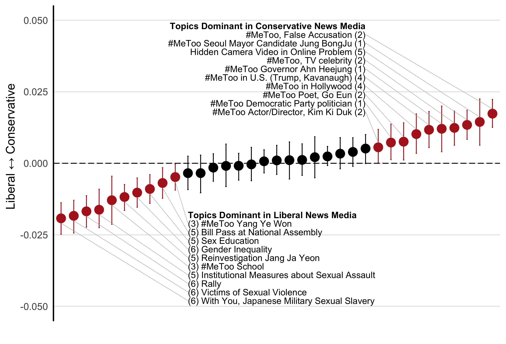
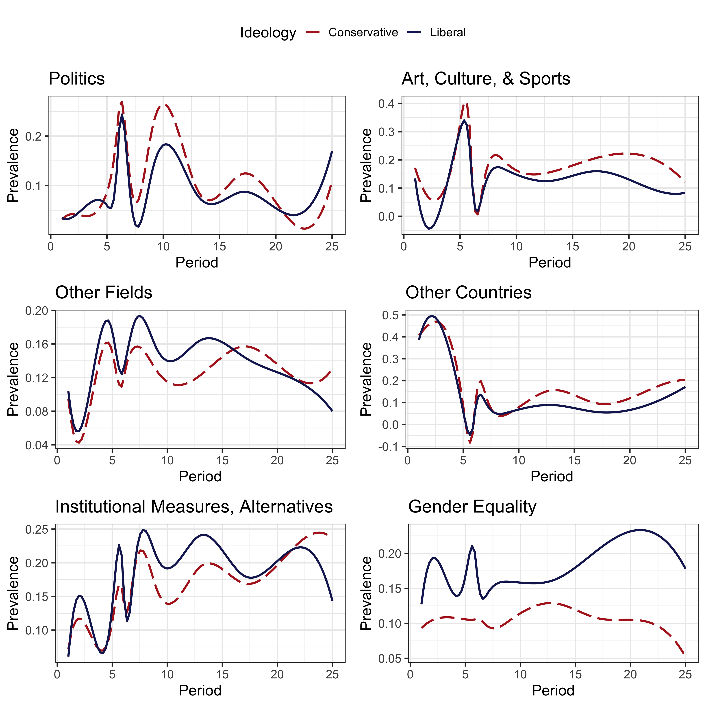
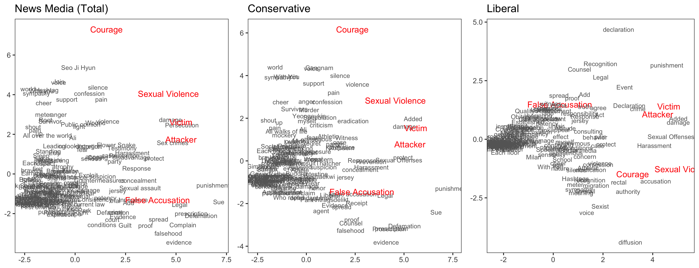

## Abstract

When a social event of a minority issue happen, how news media address and frame the issue has a significant impact on the remaining majority's understanding and impression of the issue. Here, I show how news media frame the same issue drastically different from each other, depending on their political slant. For this purpose, I collected all the text and metadata of news articles about the #MeToo movement in South Korea for two years (from October 2017 to October 2019). Applying structural topic modeling, I show that (1) news media with different political slants significantly address this issue in different ways: conservative media was heavily focused on the liberal politicians' #MeToo scandals, while liberal media was focused on the institutional and structural cause of the problem. Also, using a vector space word embedding algorithm (i.e., word2vec), I show that the overall media landscape was more aligned with the framing of conservative media than the framing of liberal media.

## Figures

<b>Figure 1.</b> Frequency of media reports on the issue by the time.

&nbsp;

<b>Figure 2.</b> Overall topic proportion.

&nbsp;

<b>Figure 3.</b> Different topic proportion by political slant of news media.

&nbsp;

<b>Figure 4.</b> Different topic proportion by political slant of news media and time.

&nbsp;

<b>Figure 5.</b> Reduced dimensionality showing the alignment of issue framing.

&nbsp;

[Go Back to Home](https://jehoonchae.github.io)
