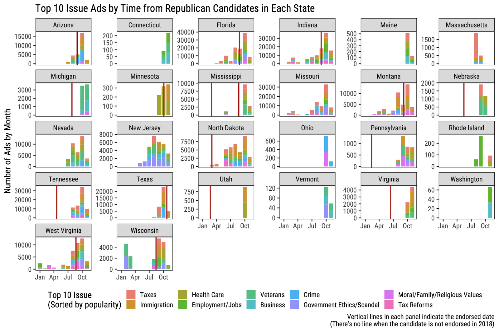

## Abstract

Former president Donald J. Trump has endorsed more than 400 candidates who shared his vision on key political issues since he was elected president in 2016. In the 2018 U.S. election, for instance, Trump endorsed 75 candidates running for House and Senate, and 42 of them won their general elections. Although there are abundant discussions regarding the effect of Trump’s endorsement on election outcomes, little is known about how the endorsement of Trump affects the campaign strategies of the endorsed Republican candidates. Against this background, we investigate the effect of Trump’s endorsement on each candidate’s political campaign strategy by analyzing the comprehensive hand-coded contents of all of the TV campaign ads aired during the 2018 election, weekly polling data, and demographic traits of the constituents (i.e., age, racial composition, income, and education) of the target electoral districts. We confirmed that Republican Senate candidates who were endorsed by Trump aired ads about the issues preferred by Trump more heavily than candidates who were not endorsed and that those endorsed candidates aired ads directly mentioning Trump or positively describing Trump more frequently than candidates who were not endorsed. However, there was no systematic pattern when we compared this ad airing pattern between pre and post-endorsement periods. The patterns we see in this preliminary analysis can imply that Trump endorsed candidates who are already having well-aligned issue preferences rather than affecting candidates’ campaign strategies by endorsing each candidate.

## Figures

<b>Figure 1.</b> Different proportion of top 10 issue ads between endorsed and not endorsed candidates.

&nbsp;

<b>Figure 2.</b> Number of issue varies by time in each state (pre and post endorsement comparison) 

&nbsp;

